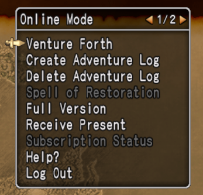

# dqxclarity

dqxclarity is a Python program that enables the game to display in English. It uses both a live translation service and modded game file to render English in the game client.

## download

[Direct Download :octicons-download-16:](https://github.com/dqx-translation-project/dqxclarity/releases/latest/download/dqxclarity.zip){ .md-button }

## pre-requirements

- (Recommended) A live translation API
    - dqxclarity supports several paid API options, as well as free trials for [DeepL](./dqxclarity/apis/deepl.md) and [Google Translate](./dqxclarity/apis/google_api.md), which now have much more limited/restrictive free trials than they had previously.
    - dqxclarity also has the option of using a "free" version of several APIs. The translation is not as good or stable as using one of the options above, but it is an option
	for those who don't wish to use a paid one.

!!! tip

    An API key is effectively a password used to authenticate yourself against a service (like DeepL or Google Translate.) This key is provided to you after setting up an account with an API service and should be **treated as sensitive**. Anyone with this key has the equivalent of your username and password to another website.

- A modern version of the Windows OS (10/11). dqxclarity is known **not** to work on Windows 7

!!! warning

    Dragon Quest X **must be installed** (and fully patched!) before performing these steps. Using dqxclarity to patch the game into English
	prior to the normal patching process finishing may corrupt your DQX install, requiring you to re-install the game. This is because dqxclarity downloads a modded DAT (game file) and places it in your DQX game directory. If the game isn't fully patched, it will attempt to use this file and cause problems.

**For instructions on how to get an API key:**

As of now, this site only covers sign-up instructions for the DeepL and Google Translate APIs.

- [DeepL](./dqxclarity/apis/deepl.md) (limited free trial)
- [Google Translate](./dqxclarity/apis/google_api.md) (requires a one-time payment for trial sign-up)

## installation

- Download the latest version of the zip file by clicking the [direct download link above](#download)
- Unzip `dqxclarity.zip` and place it somewhere to be run

!!! warning

    Do not place this folder in `C:\Program Files (x86)`. Either your desktop, My Documents, or anywhere else will work. Additionally, the program does not currently support having accented characters, umlauts, diacritics, or any non-english character in the path. If your username contains these letters, place the folder somewhere else. A OneDrive directory
	will also not work, and the program will not open if it detects it is in such a directory.

- Inside of the dqxclarity folder, right-click `DQXClarity.exe` and click "Run as administrator"

- Upon launching, dqxclarity will prompt you to install .NET 9 if you do not have it. Go through this install process

- dqxclarity will open. If you do not have python already installed, User Account Control will ask for permission to install it. Click "Yes"

- Click "OK" as shown in the screenshot

{ width="500" }
/// caption
///

- Python will silently install in the background as well as other dependencies, once this finishes, you'll see the GUI below.

{ width="500" }
/// caption
///

!!! note "Recommended settings are..."
    - Check **Nameplates** under the **General** tab
	- Selecting an API based on the decision you made in the [pre-requirements](#pre-requirements) section under the **General** tab
    - Click **Patch Game Files**, **Patch Launcher**, and **Patch Config** under the **Game** tab to patch the game into English and use the English versions of the DQX launcher and config program respectively
	- Check **Launch DQX with dqxclarity** in the **Game** tab to automically open the DQX launcher when dqxclarity is run

!!! note "Validating your key"

    Once you have checked one of the API options and entered your key, click "Validate Enabled Key" and check out the message at the bottom. You should receive some type of "success" message if the key works. This does not work with the "free" options. If the key fails to validate, you will see "Failed to validate key." If this is the case, please ensure that the key was pasted correctly. If you need help with this, please join the [Discord](https://discord.gg/dragonquestx) and make a new post in the #clarity-help forum.

- Click "Run" in the bottom right corner

- Briefly read through the output. The last line should read "Done! Keep this window open" Once you see this message, go ahead and log into your DQX account

{ width="500" }
/// caption
///

- You should now notice that DQX is in English.

!!! success
    The window that opened must remain open for the entirety of your gaming session. You can minimize this window and start playing!

{ width="500" }
/// caption
///

## installation troubleshooting

### My antivirus says dqxclarity is a virus

When you download and extract dqxclarity, your antivirus may trigger and flag the program as a virus. This is a false positive and can be ignored, but you may need to make an exception in your antivirus to mark the executable as OK. I recommend making an exception to the entire `dqxclarity` folder. The reason this program is flagged is because it's an unsigned executable that changes frequently. Signing an executable from a trusted certificate authority costs real money per year (in the range of $70-$500 USD) and as this is a hobby project, it isn't worth the price to the developer.

### I extracted the zip and the dqxclarity.exe program disappeared (or isn't there)

Your antivirus is removing dqxclarity from your computer. I'd suggest [adding an exclusion](https://support.microsoft.com/en-us/windows/add-an-exclusion-to-windows-security-811816c0-4dfd-af4a-47e4-c301afe13b26) to your entire dqxclarity folder in this case. If you use something other than Windows Security, you will need to Google how to add an exclusion/exception using that software.

### When I launch dqxclarity, the game dialog is translated, but all of the menus are still in Japanese

Make sure you clicked "Patch Game Files" in the "Game" tab before launching the game. This downloads two custom files that are then placed in your game folder, which is what enables all of the in-game menus to be translated.

If you're still seeing the menus in Japanese, note that every time the game patches, it overwrites the modded files. You will need to re-download them by clicking the "Patch Game Files" button again.

## uninstallation

- Simply delete the dqxclarity folder from your computer. All installed components are contained in this folder
- Uninstall `Python 3.11.3 32-bit` from Control Panel

## faq

### Can I get in trouble for using dqxclarity?

Short answer: probably not. Although what dqxclarity is doing is against the ToS, many overseas players have been using dqxclarity for quite some time and we've heard of no one receiving a ban, or even warned for using it. This doesn't mean that it _can't_ happen, so there will always be an inherent risk, but it is likely to be very small.

### Can Japanese players see that I'm using dqxclarity?

Everything dqxclarity does is client side, so only you will see it. _However_, there are 2 specific instances where they _can_ determine that you're using dqxclarity:

- Crafting a 3 star item
- Catching a King sized fish

Doing either of these things will broadcast a message in English that all nearby players can see. English itself isn't prohibited, but this message is automated and supposed to be in Japanese, so seeing it in English instead of Japanese could raise an eyebrown. It's doesn't hurt to craft and fish in secluded places, such as your home, a My Town, or a less populated server/area if you're paranoid, but others perform these same actions in public without a problem.

### Every time I talk to an NPC, my game freezes for a few seconds

This is not a bug, but an (unfortunate) expected experience. As we don't have access to server-side text in game, text that is encountered is translated on-the-fly by sending it to a translation service like DeepL or Google Translate. The time it takes for the text to send, be translated and returned is the duration of the pause you're experiencing, and the length of the pause can vary based on the API service you choose to use. There isn't really anything we can do about this issue and it's just a behavior you have to get used to.
