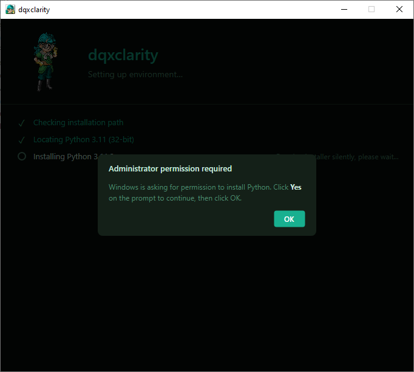
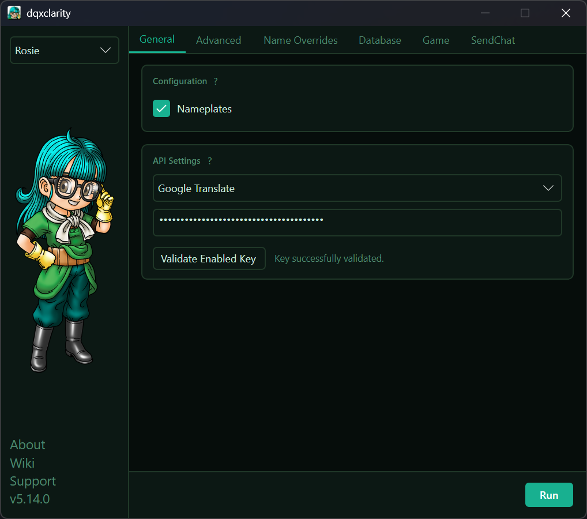
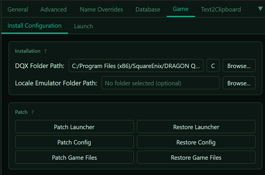
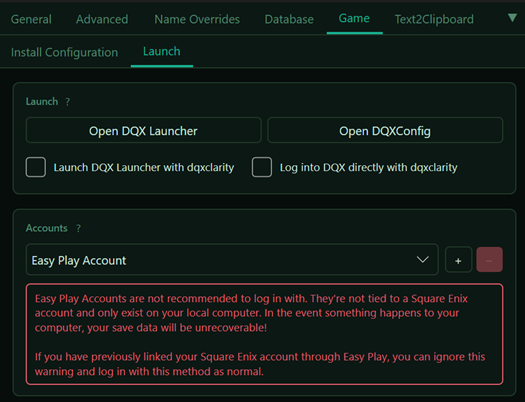
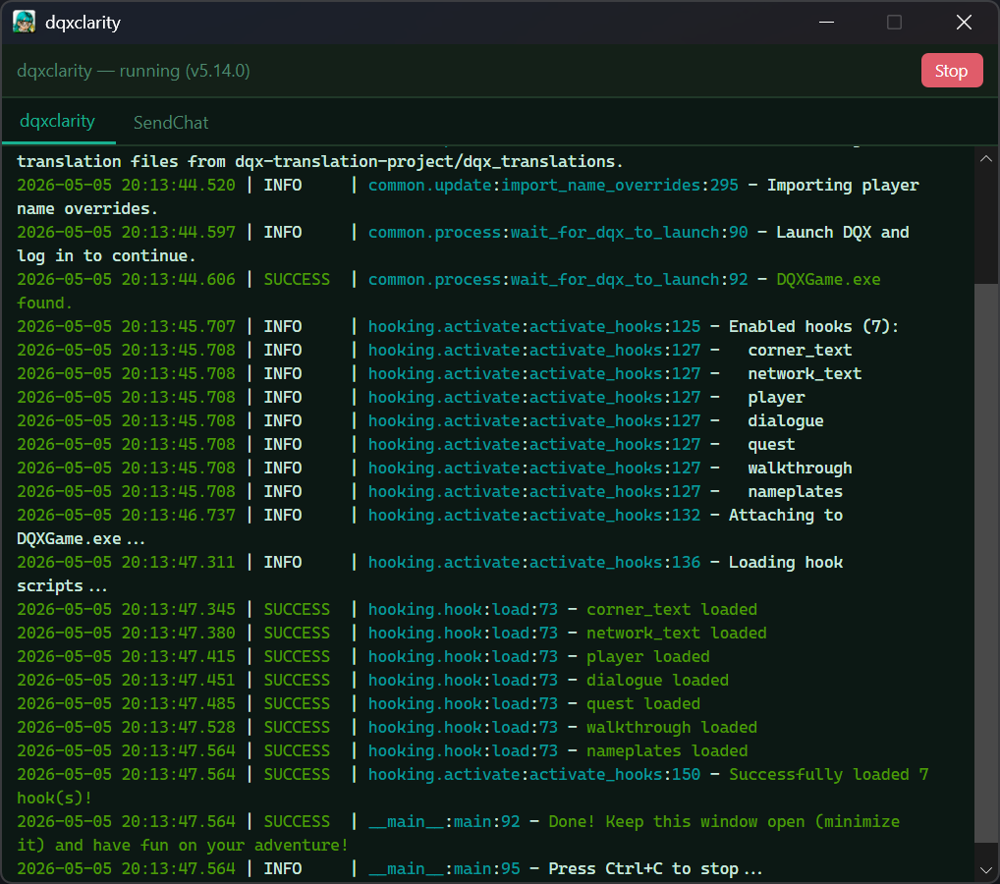

# dqxclarity

dqxclarity enables live translation of game server text using a supported translation API. It intercepts game text internally, translates it and releases it back to the game to be displayed in English.

## download

[Direct Download :octicons-download-16:](https://github.com/dqx-translation-project/dqxclarity/releases/latest/download/dqxclarity.zip){ .md-button }

## pre-requirements

- A modern version of the Windows OS (10/11). dqxclarity is known **not** to work on Windows 7
- (Recommended) A live translation API
    - It supports several paid API options:
        - [DeepL](./dqxclarity/apis/deepl.md)
        - ChatGPT/OpenAI
        - [Google Translate](./dqxclarity/apis/google_api.md)
    - As well as some built in self-hosted or free options:
        - Google Translate (free - mobile API)
        - Google Translate PA (free, unofficial)
        - LibreTranslate (free public instance or self-hosted)
        - Ollama (self-hosted)
        - Yandex Translate (free)

!!! warning

    Dragon Quest X **must be installed** (and fully patched!) before performing these steps. Using dqxclarity to patch the game into English prior to the normal patching process completing may corrupt your DQX install, requiring you to re-install the game. This is because dqxclarity downloads a modded DAT (game file) and places it in your DQX game directory. If the game isn't fully patched, it may attempt to use this file and cause you problems.

## api services (paid)

As of now, this site only covers sign-up instructions for the DeepL and Google Translate APIs.

- [DeepL](./dqxclarity/apis/deepl.md) (limited free trial)
- [Google Translate](./dqxclarity/apis/google_api.md) (requires a one-time payment for trial sign-up)

dqxclarity also supports the following paid APIs without setup documentation:

- ChatGPT/OpenAI

## installation

- Download the latest version of the zip file by clicking the [direct download link above](#download)
- **Extract** `dqxclarity.zip` and place it somewhere to be run

!!! warning

     Do not extract `dqxclarity.zip`...

      - within "Program Files"
      - within a OneDrive directory
      - in a path that contains special characters (typically a username). It may struggle with non-ascii characters (like accents, umlauts, diacritics, etc.)

- Inside of the dqxclarity folder, right-click `DQXClarity.exe` and click "Run as administrator"
- Upon launching, dqxclarity will prompt you to install .NET 9 if you do not have it. Step through this install process
- dqxclarity will open. If you do not have the Python version that dqxlclarity requires already installed, you will be prompted to install it
- Click "OK" as shown in the screenshot

{ width="500" }
/// caption
///

- Python will silently install in the background, as well as its dependencies. Once this completes, you are presented with the main window:

{ width="500" }
/// caption
///

!!! tip

    dqxclarity is currently undergoing many changes, so your window may not look _exactly_ as such

## configuration

Each of the tabs has a little "?" you can click on that explains what they do. This document will not guide you through each one as these may change at any time and updating document is tedious.

What is important is ensuring that under the "Game" tab, your "DQX Folder Path" is correctly pointing at your DQX installation directory. This will enable a few important options you should do:

Under the "Installation Configuration" tab:

{ width="500" }
/// caption
///

- Click "Patch Game Files" to install the translated local game files to your game directory
- (**Optional**) Click "Patch Config" to intall a translated DQXConfig.exe
    - This is the purple Dracky utility that sets up your controller configuration, graphics settings, etc.
- (**Optional**) Click "Patch Launcher" to install a translated DQXLauncher.exe
    - This is the main launcher when launching the game

Next, under the "Launch" tab:

{ width="500" }
/// caption
///

This screen allows you to bypass the official game's launcher and launch directly into the game. It supports saving your credentials and will prompt you if you use an OTP. Your credentials are verified with the official DQX servers and then saved locally inside of your `user_settings.ini` in the `dqxclarity` directory. These credentials are saved in **plain text**, so do not share your `user_settings.ini` file with anyone! Your credentials are **never** sent externally to anyone.

Although you cannot create an Easy Play account through the launcher, if you have an existing account, you can launch the game with it this way as well.

Launching the game with this method is also **required** if you want to take advantage of native copy/paste support!

## launching

- Click "Run" in the bottom right corner
- Briefly read through the output. The last line should read "Done! Keep this window open (minimize it) and have fun on your adventure!". This means that dqxclarity is ready to translate

{ width="500" }
/// caption
///

!!! success
    The window that opened must remain open for the entirety of your gaming session. You can minimize this window and start playing!

## uninstallation

- Simply delete the dqxclarity folder from your computer. All installed components are contained in this folder
- Uninstall `Python 3.11.3 32-bit` from Control Panel
