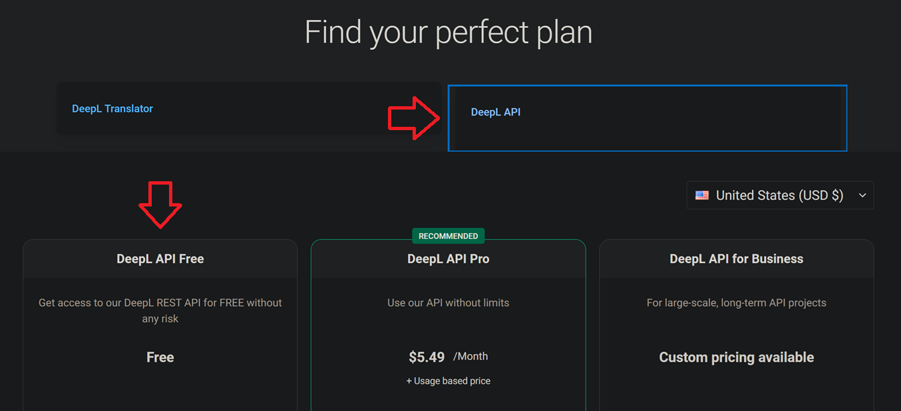

# deepl

This will cover all the steps required to get set up with DeepL in order to use the Translate dialog feature in [dqxclarity](../../dqxclarity.md). This is used to enable live translation of server-side text in game as it is encountered.

## Requirements

- A **valid** debit/credit card

!!! warning "Supported countries"
    Check DeepL's [supported countries](https://support.deepl.com/hc/en-us/articles/360020016339-Countries-where-DeepL-paid-plans-are-available) page to see if your billing country is supported. If your country is not on this list, you will receive errors during sign-up. [Google Translate API](./google_api.md) is an alternative option in this case.

## Creating an account

- Visit the [DeepL API](https://www.deepl.com/pro#developer) registration page and click "Sign up for free"

{ width="600" }
/// caption
///

!!! info
    Signing up for the wrong account type (DeepL Translator versus DeepL API) will make it to where you can't generate a key. Make sure you are on the "DeepL API" tab before selecting "Sign up for free".

    If you don't see the "DeepL API Free" column like in the screenshot, try resizing your browser.

- Register for an account. There are no screenshots here as the registration process is very straight forward
- Once your account has been created and you've signed up, if you aren't already, log in
- Inside of your account page, click on the "Account" tab and scroll all the way down to "Authentication Key for DeepL API"

!!! warning
    If you see "Authentication Key (DeepL API and CAT tool integration)", your account was signed up for the wrong account type. Sometimes this is user error, but recently, it has been observed as a fault on DeepL's side. You will need to contact DeepL support (**support@deepl.com**) for assistance with correcting this. Feel free to use the below as an e-mail template for requesting for help. Be sure to provide the e-mail address and DeepL account name in your email:

    > *Hello, I intended to sign up for a DeepL Developer REST API (free) account, but it looks like my account was set up as an "Individuals and teams" account for use with the CAT tools. Can you please help me convert my account to a Developer account so that I can access the REST API? Thanks!*

- This key is what you will enter into dqxclarity for DeepL

## Character limit

This service is free as you're signing up for a free Developer account. Your DeepL account is restricted to translating 500,000 characters per month. Once this limit is reached, your authentication key will no longer allow you to translate anything until it resets. Resets happen monthly and are on the following month of your initial sign-up date.

!!! info
    500,000 characters is a lot of text, so unless you're playing through the story and all side quests for 10+ hours a day, you won't reach this limit.
