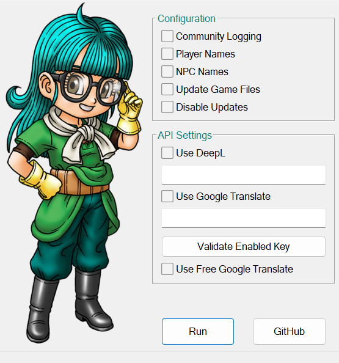
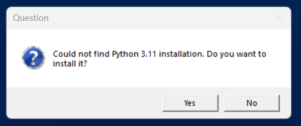
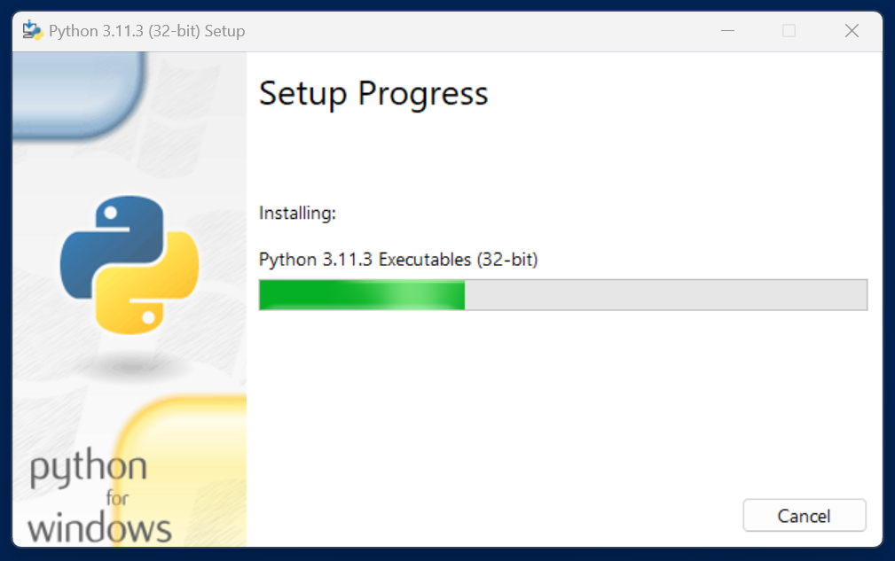
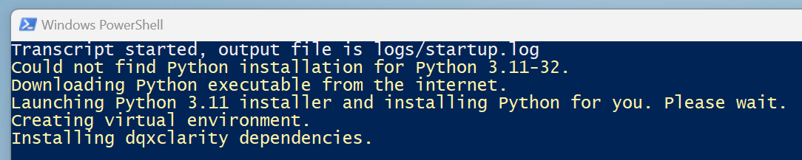
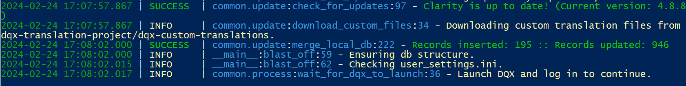
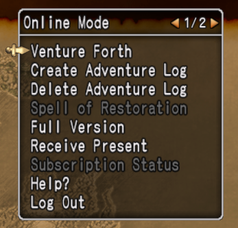

# dqxclarity

dqxclarity is a Python program that enables the game to display in English. It uses both a live translation service and modded game file to render English in the game client.

## download

[Direct Download](https://github.com/dqx-translation-project/dqxclarity/releases/latest/download/dqxclarity.zip)

## pre-requirements

- A live translation API key
    - Currently, only [DeepL](./apis/deepl.md) and [Google Translate](./apis/google_api.md) are supported.

!!! tip

    An API key is effectively a password used to authenticate yourself against a service (like DeepL or Google Translate.) This key is provided to you after setting up an account with either service and should be **treated as sensitive**. Anyone with this key has the equivalent of your username and password to another website.

- A modern version of the Windows OS (10/11). dqxclarity is known **not** to work on Windows 7

!!! warning

    Dragon Quest X **must be installed** (and fully patched!) before performing these steps. Launching dqxclarity prior to finishing patching has the potential to corrupt your DQX install, requiring you to re-install the game. This is because dqxclarity downloads a modded DAT (game file) and places it in your DQX game directory. If the game isn't fully patched, it will attempt to use this file and cause problems.

**For instructions on how to get an API key:**

- [DeepL](./apis/deepl.md)
- [Google Translate](./apis/google_api.md)

## installation

- Download the latest version of the zip file by clicking the [direct download link above](#download)
- Unzip `dqxclarity.zip` and place it somewhere to be run

!!! warning

    Do not place this folder in `C:\Program Files (x86)`. Either your desktop, My Documents, or anywhere else will work. Additionally, the program does not currently support having accented characters, umlauts, diacritics, or any non-english character in the path. If your username contains these letters, place the folder somewhere else.

- Inside of the dqxclarity folder, right-click `DQXClarity.exe` and click "Run as administrator"

{ width="500" }

!!! note "We recommend checking..."
    - **Player Names**
    - **NPC Names**
    - **Update Game Files**
    - Selecting either **Use DeepL** or **Use Google Translate**, based on the API that you signed up for in the [pre-requirements](#pre-requirements) section

!!! note "Validating your key"

    Once you have checked one of the API options and entered your key, click "Validate Enabled Key" and check out the message at the bottom. You should receive some type of "success" message if the key works. If the key fails to validate, you will see "Failed to validate key." If this is the case, please ensure that the key was pasted correctly. If you need help with this, please join the [Discord](https://discord.gg/dragonquestx) and ask for help in the **#clarity-questions** channel.

- Click "Run"
- On your first launch, you will be prompted to install Python. Click "Yes"

{ width="500" }

- User Account Control will ask for elevated permissions to install Python. Click "Yes"

{ width="500" }

- Python will install. Wait until the installation has completed
- Once completed, you will see "Installing dqxclarity dependencies". Wait for this to complete

{ width="500" }

- Briefly read through the output. The last line should read "Launch DQX and log in to continue." Once you see this message, go ahead and log into your DQX account and launch the game

{ width="500" }

- You should now notice that DQX is in English.

!!! success
    The window that opened must remain open for the entirety of your gaming session. You can minimize this window and start playing!

{ width="500" }

## installation troubleshooting

### My antivirus says dqxclarity is a virus

When you download and extract dqxclarity, your antivirus may trigger and flag the program as a virus. This is a false positive and can be ignored, but you may need to make an exception in your antivirus to mark the executable as OK. I recommend making an exception to the entire Clarity folder.

### I extracted the zip and the dqxclarity.exe program disappeared (or isn't there)

Your antivirus is removing dqxclarity from your computer. I'd suggest [adding an exclusion](https://support.microsoft.com/en-us/windows/add-an-exclusion-to-windows-security-811816c0-4dfd-af4a-47e4-c301afe13b26) to your entire dqxclarity folder in this case. If you use something other than Windows Security, you will need to Google how to add an exclusion/exception using that software.

### When I launch dqxclarity, a window opens and immediately closes

There are so many reasons why this could occur, but first, take a look inside of your dqxclarity folder and look for a folder called `logs`. Inside of that is a file called `startup.log`. The error message should be listed in here.

A few common issues:

- There's a bug within dqxclarity where users that have their computer locale/region set to something non-English experience a crash when launching. This is due to Python being unable to evaluate the running processes on your computer to see if DQX is running. You can bypass this by disabling "Update Translated Game Files" and additionally starting dqxclarity *after* DQX has been open. You'll want to wait until you're on the "Important Notice" screen to launch dqxclarity.

- A dependency couldn't be found. You can try deleting the `venv` folder in your dqxclarity folder and relaunching to see if it fixes your issue.

If you aren't sure what to do, please stop by the [Discord](https://discord.gg/dragonquestx), post your issue in the #clarity-questions channel (with the accompanying `startup.log` file attached) and we'll be happy to take a look.

### When I launch dqxclarity, the game dialog is translated, but all of the menus are still in Japanese

Make sure you checked "Update Game Files" in the dqxclarity window. This downloads two custom files that are then placed in your game folder, which is what enables all of the in-game menus to be translated.

If you're still seeing the menus in Japanese, note that every time the game patches, it overwrites the modded files. You will need to re-download them by launching dqxclarity and ensuring that "Update Game Files" is checked.

## uninstallation

- Simply delete the dqxclarity folder from your computer. All installed components are contained in this folder
- Uninstall `Python 3.11.3 32-bit` from Control Panel

## faq

### Can I get in trouble for using dqxclarity?

Short answer: probably not. Although what dqxclarity is doing is against the ToS, many overseas players have been using dqxclarity for quite some time and we've heard of no one receiving a ban, or even warned for using it. This doesn't mean that it _can't_ happen, so there will always be an inherent risk, but it is likely to be very small.

### Can Japanese players see that I'm using dqxclarity?

Everything dqxclarity does is client side, so only you will see it. _However_, there are 2 specific instances where they _can_ determine that you're using dqxclarity:

- Crafting a 3 star item
- Catching a King sized fish

Doing either of these things will broadcast a message in English that all nearby players can see. English itself isn't prohibited, but this message is automated and supposed to be in Japanese, so seeing it in English instead of Japanese could raise an eyebrown. It's doesn't hurt to craft and fish in secluded places, such as your home, a My Town, or a less populated server/area if you're paranoid, but others perform these same actions in public without a problem.

### Every time I talk to an NPC, my game freezes for a few seconds

This is not a bug, but an (unfortunate) expected experience. As we don't have access to server-side text in game, text that is encountered is translated on-the-fly by sending it to a translation service like DeepL or Google Translate. The time it takes for the text to send, be translated and returned is the duration of the pause you're experiencing. There isn't really anything we can do about this issue and it's just a behavior you have to get used to.

### Every time I encounter a loading screen or change zones, the game throws an error or crashes!

The reason this happens is because dqxclarity does not currently have an intelligent way to re-hook itself back into the game. During loading screens, the game has to "hide" the fact that it's inside of the process, or you will receive an error message (INVALID_CALL_1). dqxclarity is configured to wait a short period of time during loading screens before re-attaching to the game. If you have a slow/older computer that takes too much time to transition out of the loading screen, you will inconsistently (and possibly consistently) run into this problem.

**Workaround:** Note that I will not support installations that run into these issues. This problem is usually seen with people that run DQX on very slow/old computers or laptops. I can provide you a workaround that you can try, but it's just a workaround.

- Inside of your dqxclarity folder, go into the `hooking` folder and open `hide_hooks.py` in a text editor (like Notepad, Notepad++, etc.)
- Look for this very specific line: `time.sleep(1)`
    - This number indicates how long dqxclarity waits (in seconds) before it re-attaches itself to the game
- You can attempt to tweak the wait time by changing this number from `1` -> `2`.
    - If the errors continue, you can try increasing this number in `.5` second increments until the issue goes away. Changing this value too high will most certainly have diminishing returns and could affect other areas of dqxclarity.

!!! warning
    Since you've directly edited the file, any future updates from dqxclarity will overwrite these changes. You will need to come back into this file and change the value back to what you used before.
