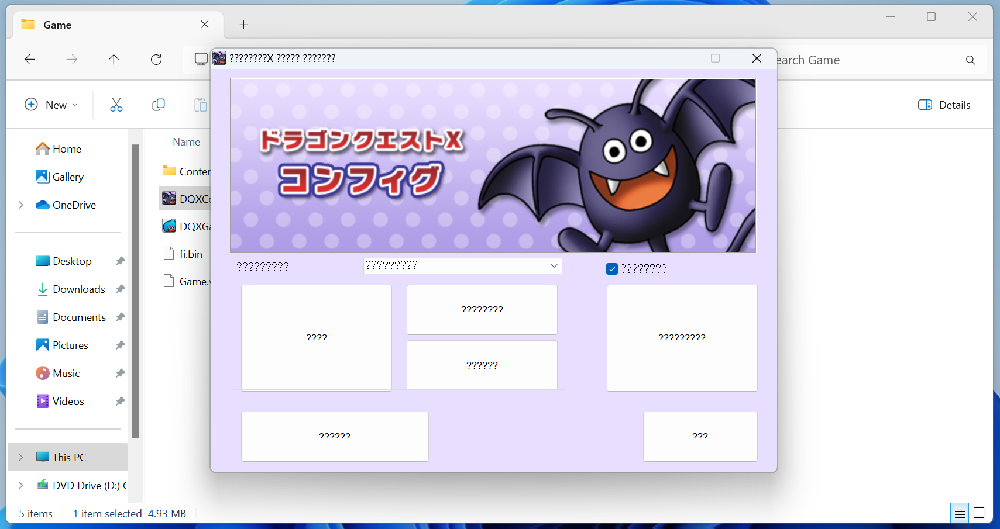
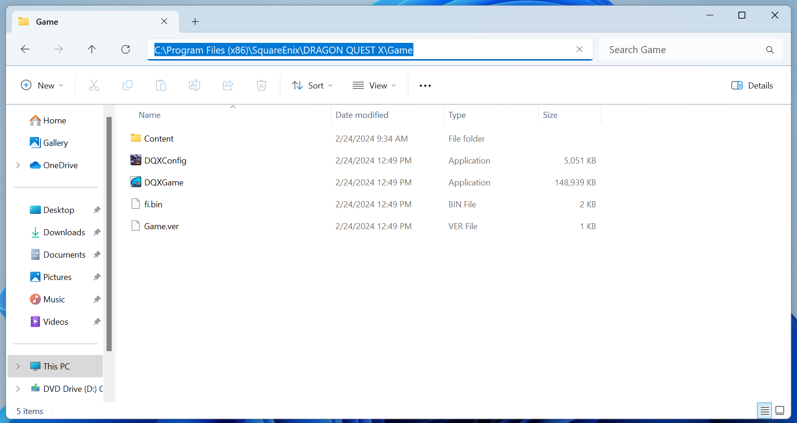
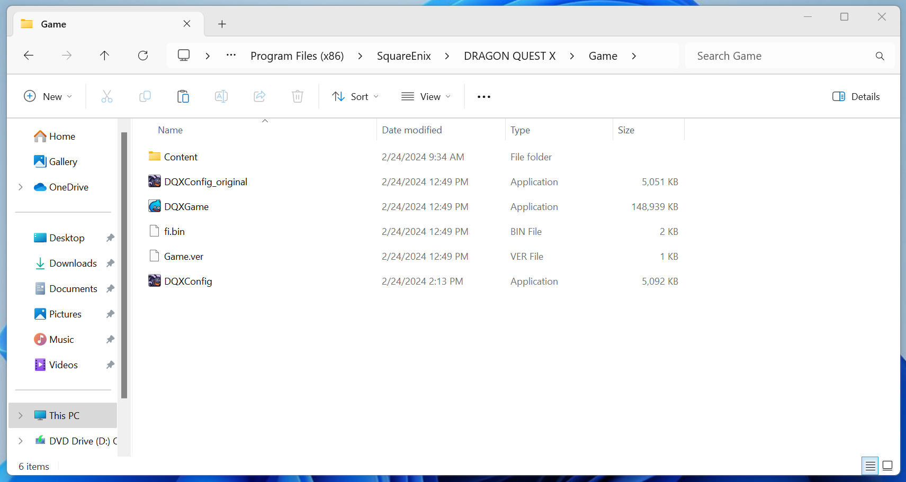
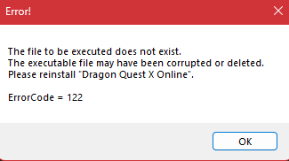

# dqxconfig

Several of DQX's settings (Sound, BGM, controller settings, keyboard settings, etc.) are controlled in an external utility packaged with the game named `DQXConfig.exe`. This configuration is entirely in Japanese and additionally will display a bunch of question marks if you don't have the Japanese language pack installed on your computer. It has been updated to reflect the English language instead.

{ width="700" }
/// caption
///

## download

[Direct Download :octicons-download-16:](https://github.com/dqx-translation-project/dqx_en_config/releases/latest/download/DQXConfig.exe){ .md-button }

## instructions

- Download the file by clicking the button above
- Navigate to the place where you installed Dragon Quest X
  - By default, this is installed in `C:\Program Files (x86)\SquareEnix\DRAGON QUEST X`
- Open the `Game` folder (Not **Boot**!)

{ width="500" }
/// caption
///

- Rename the file named `DQXConfig` to `DQXConfig_original`

!!! note
    If your file has a `.exe` at the end, that's fine. You just have file extensions showing. Add the name before the `.exe`, so `DQXConfig_original.exe`

- Place the file you previously downloaded in this directory. It should also be named `DQXConfig`

!!! note
    If you downloaded it multiple times, you may have a `(1)`, `(2)`, etc. at the end of the file. Make sure the file is exactly named `DQXConfig`

    If your file previously had a `.exe` at the end, make sure the `.exe` still exists in the file, so `DQXConfig.exe`

{ width="500" }
/// caption
///

!!! success
    You're finished. You can run this file directly or open it using any other method (in the launcher, click the purple Dracky or directly in game) and the English launcher will be used.

{ width="500" }
/// caption
///

## faq

### Opening the config causes my antivirus to trigger

This is a false positive and is due to the original file being modified to insert the English text. You will need to allow the program to continue to run and/or allow it in your antivirus tool. This assumes you have downloaded the modified tool from [this page](#download).

### Launching the game causes error code 122

{ width="500" }
/// caption
///

This is seen when Dragon Quest X cannot find `DQXConfig.exe` in the `Game` directory.

To fix:

- Make sure you followed the above instructions exactly -- including naming the file correctly.
- If the DQXConfig icon has a shield on it, this indicates that the file is requiring being run as an administrator. This typically happens due to system permissions on your computer. The easiest and most painless solution to this is to ensure that you are launching DQX as an administrator so that it has the appropriate permissions to launch DQXConfig.
