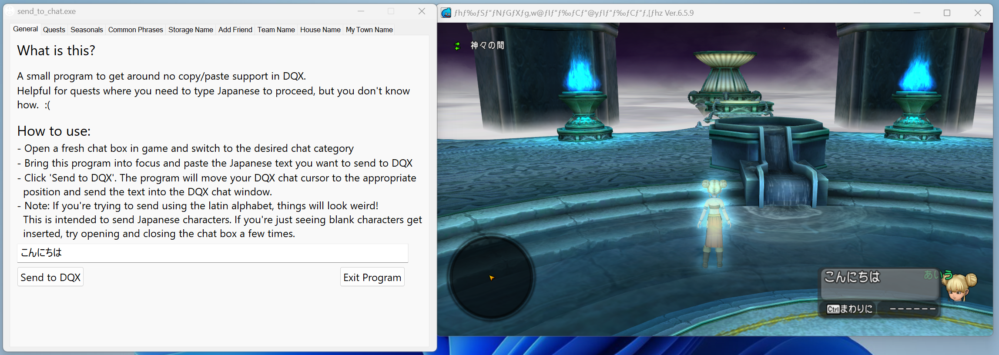

# send to chat

DQX has several quests that require you to type in Japanese in order to progress. This can prove difficult as your average English player does not know how to type in Japanese. Additionally, there is no copy/paste support in the game.

This tool aims to solve this by pasting the Japanese into the chat box for you. Most of the known chat quests are embedded in the program and you can simply select them from a dropdown.

## download

[Direct Download :octicons-download-16:](https://github.com/dqx-translation-project/dqx-send-to-chat/releases/latest/download/send_to_chat.exe){ .md-button }

## instructions

- Download the file by clicking the button above
- With Dragon Quest X open, open `send_to_chat`

!!! note
    If you receive a warning from your antivirus, you can safely ignore it. Accept the warning and/or add it to your exception list in your antivirus

- The main "General" tab does a good job of explaining how to use the tool, but the gist is:
    - Open your chat window (and make sure it's blank!)
    - Input the Japanese text you want to send to the chat screen
    - Click "Send to DQX"

{ width="500" }

Although you can enter text in this window, the send to chat is commonly used for progressing quests. The same instructions apply for the "Quests" tab.

Other tabs have instructions on the requirements to get them to work for their purpose.

## faq

### Nothing happens when I click "Send to DQX"

There are several possibly remedies to this:

- Re-open DQX. send to chat should be opened _after_ DQX has launched
- Make sure your chat window is open before clicking "Send to DQX"
  - This also requires your chat window to be opened the "correct" way. By "correct", this means opening the chat window naturally with `shift+enter` (if on keyboard), `spacebar` (if on controller), etc. Do not open the chat window from the "Frequent Phrases" screen and then delete the text
- Reboot your computer. This tool is directly modifying in-game memory and there may be a problem that a computer reboot can solve
- Add send to chat to your antivirus's exception list (even if you're on Windows Defender!). Antivirus tools are known to block executables (such as send to chat) that appear to be doing malicious activities
- If DQX is running as administrator, send to chat must also be run as administrator. If you aren't sure, then just run send to chat as an administrator

### Clicking "Send to DQX" crashes DQX

We've seen this occurring in two scenarios:

- DQX recently updated and send to chat needs to be updated to work with the newest game patch
  - If this is the case, please check back later until this is fixed
- You opened your chat window "incorrectly". The "correct" way (the way send to chat expects it) is to open the chat window naturally with `shift+enter` (if on keyboard), `spacebar` (if on controller), etc. Do not open the chat window from the "Frequent Phrases" screen and then delete the text
