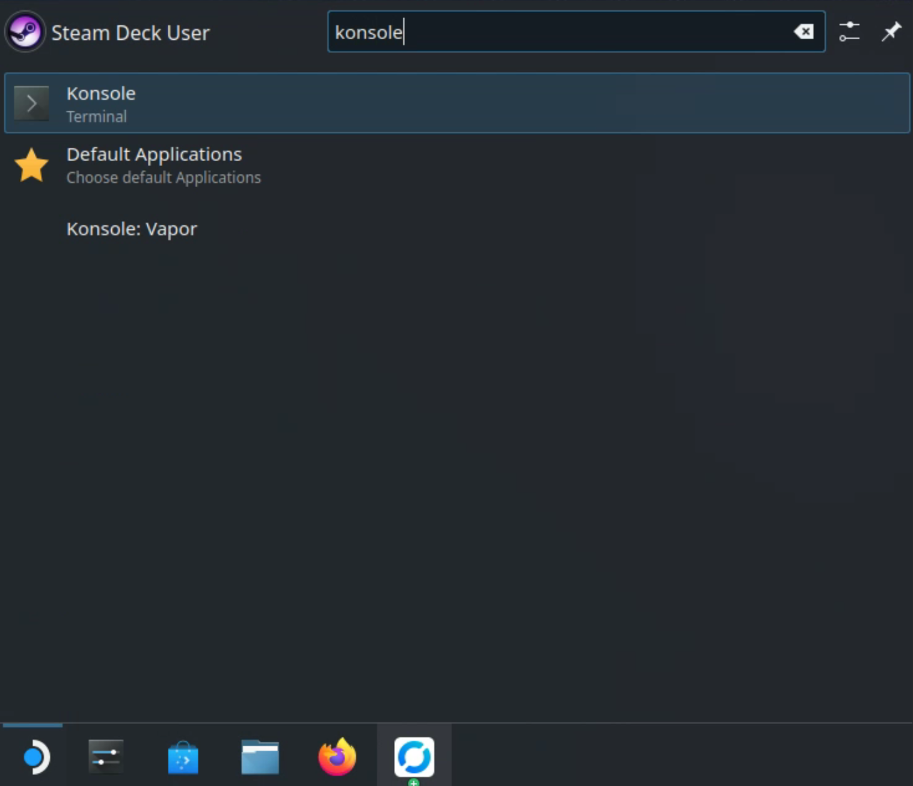
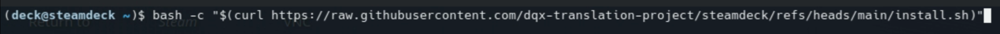
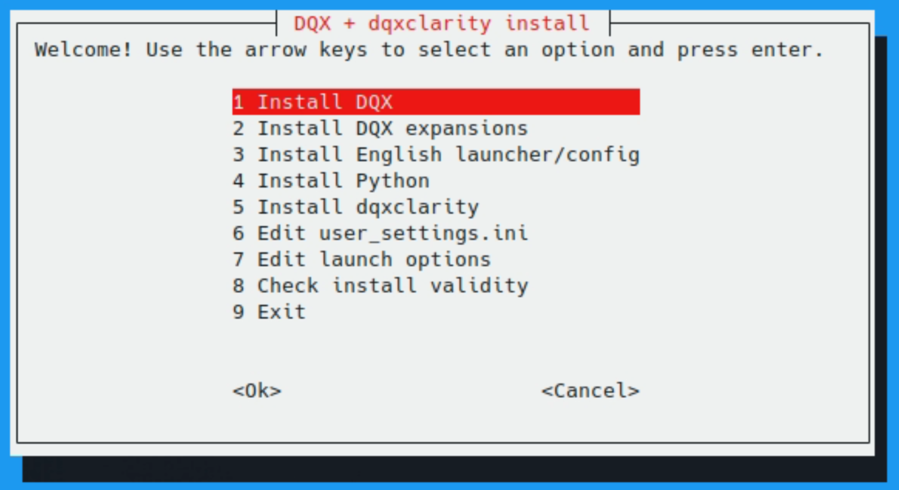

# steamdeck

DQX and [dqxclarity](dqxclarity.md) can be run together directly on your Steam Deck without the need to dual boot Windows. This is done by running dqxclarity within the same wine prefix that DQX resides in, giving it access to the same process space.

!!! info

    Serany does not play DQX on a Steam Deck and put this together as a best effort for those who have asked for this to be made available. Supporting this is extra overhead he doesn't want to manage and he doesn't want to make sure everything introduced into dqxclarity also works on the Steam Deck. Although the below instructions work, the amount of support provided will be at his discretion.

!!! warning

    You need to both be comfortable navigating around your Steam Deck and also be able to follow on-screen directions. If you're "bad with computers" or tend to ignore directions and skip ahead, this process may not be for you.

## pre-requirements

- A Steam Deck booted into Desktop Mode
    - If you're in Gaming Mode (the default mode), press the "STEAM" button on your controller, select "Power" and select "Switch to Desktop"
- Your Steam Deck must have an internet connection
- [Recommended] GE-Proton9-5, which allows playing DQX's pre-rendered videos. DQX will work with an out of the box version of Proton, but will not render pre-rendered cutscenes without this version. See below for installation

## setting up GE-Proton9-5

- While in "Desktop Mode", select the "Application Launcher" button in the bottom left and open "Discover"

{ width="500" }
/// caption
///

- In "Discover", search for "ProtonUp-QT" in the top left and press ENTER. Click "Install" in the "ProtonUp-Qt" result

{ width="500" }
/// caption
///

- After the download has fully completed, close the "Discover" store. Click on the "Application Launcher" button again and search for "ProtonUp-QT", then click on it

{ width="500" }
/// caption
///

- In the "ProtonUp-QT" launcher, click on "Add version". Make sure "GE-Proton" is selected under "Compatability tool" and "GE-Proton9-5" is selected for the version. If you don't see "GE-Proton9-5" in the list, click "Load more..." and search for it. Click "Install"

{ width="500" }
/// caption
///

- Once install has completed, click "Close"

- You will need to restart Steam for this version of Proton to get picked up. Find the Steam icon on the bottom right on your taskbar, right-click on it and select "Exit Steam", then relaunch Steam

- Continue to the installation section below, which will guide you through using this version of Proton

## installation

- While in "Desktop Mode", select the "Application Launcher" button in the bottom left and open "Konsole"

{ width="500" }
/// caption
///

- This presents you with a terminal window. To get started, you will need to type the following into the Konsole window. Make sure to copy the entire line (it scrolls!):

```
bash -c "$(curl https://raw.githubusercontent.com/dqx-translation-project/steamdeck/refs/heads/main/install.sh)"
```

!!! tip

    You have a few options here:

    - You can open this webpage onto your Steam Deck through Firefox so you can copy this command
    - You can press "X" on your Steam Deck to open the on-screen keyboard and type this way
    - You can remote into your Steam Deck from a computer and perform the commands this way. Personally, I use [Rust Desk](https://rustdesk.com/)

!!! note

    For those concerned about malicious code being run on their Steam Deck, you can review [the script](https://github.com/dqx-translation-project/steamdeck/blob/main/install.sh) yourself.

- In the Konsole window, paste this command and press enter. This will download the script and execute it on your Steam Deck

{ width="850" }
/// caption
///

- You are presented with a TUI, which is interactable with a keyboard using the arrow keys and the enter key

{ width="500" }
/// caption
///

From here, you will want to go through each option from top to bottom (1, 2, 3, etc.). This TUI will automate several commands for you and present on-screen instructions when you need to do things yourself. Just about every manual step it asks requires you to interact with your Steam client to add non-Steam games. As the script goes into detail on what to do, this guide will end here.

If you have not installed dqxclarity before and are interacting with this for the first time:

- Familiarize yourself with [dqxclarity](dqxclarity.md). These are the PC install instructions, but how it works is the same
- You will need to set up an API key ([DeepL](./dqxclarity/apis/deepl.md), [Google Translate](./dqxclarity/apis/google_api.md)), which is used for machine translating the server-side text. Optionally, you can set `enablegoogletranslatefree` to `True` if you don't want to set it up (although this provides inferior translation quality). This is done within option 6: "Edit user_settings.ini"

If you have questions, make a new post in the #clarity-help channel in the [DQX Worldwide Discord](https://discord.gg/dragonquestx). Make sure you provide as much detail as possible, including screenshots, error messages, what you did, etc. Messages like "help", "this doesn't work" or support by proxy (doing it for a friend) will be ignored.
