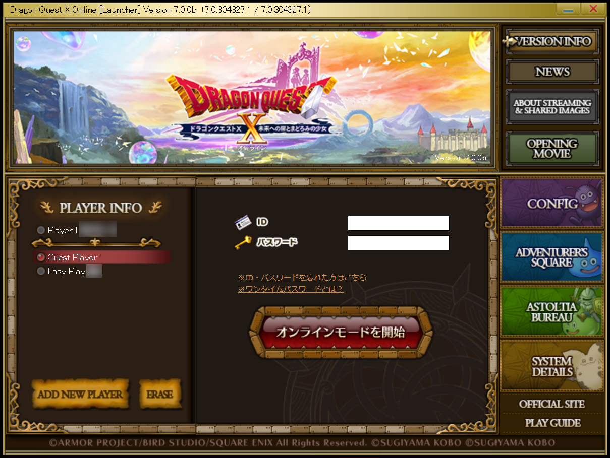

# dqxlauncher

<a href="/asset/dqxlauncher/main.png">
  
<a>

DQX's launcher is entirely in Japanese. This version of the launcher does some swaps of the Japanese assets (images and text) with English assets. This makes it easier to navigate and read error messages. 

## download

<button onclick="window.location.href='https://github.com/dqx-translation-project/dqx_en_launcher/releases/latest/download/DQXLauncher.exe';">download dqxlauncher</button> 

## instructions

- Download the file by clicking the button above
- Navigate to the place where you installed Dragon Quest X
  - By default, this is installed in `C:\Program Files (x86)\SquareEnix\DRAGON QUEST X`
- Open the `Boot` folder
- Rename the file named `DQXLauncher` to `DQXLauncher_original`
  - If your file has a `.exe` at the end, that's fine. You just have file extensions showing. Add the name before the `.exe`, so `DQXLauncher_original.exe`
- Place the file you previously downloaded in this directory. It should also be named `DQXLauncher`
  - If you downloaded it multiple times, you may have a `(1)`, `(2)`, etc. at the end of the file. Make sure the file is exactly named `DQXLauncher`
    - If your file previously had a `.exe` at the end, make sure the `.exe` still exists in the file, so `DQXLauncher.exe`

You're finished. Open DQX like you usually would and you'll see the modified launcher.

## faq

### Opening the launcher causes my antivirus to trigger

This is a false positive and is due to the original file being modified to insert the English text. You will need to allow the program to continue to run and/or allow it in your antivirus tool. This assumes you have downloaded the modified tool from [this page](#download).

### When I double click on DQXLauncher.exe, nothing happens

This is normal. You aren't intended to open the file directly. If you must, you need to open `DQXBoot.exe`, which then opens `DQXLauncher.exe`.
