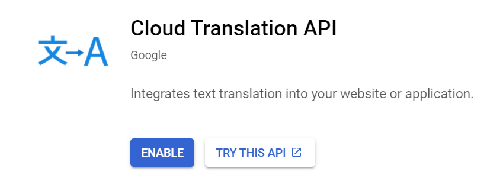
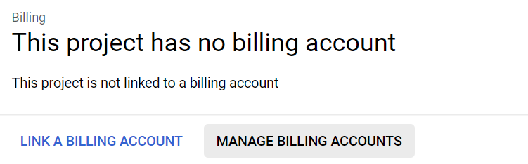
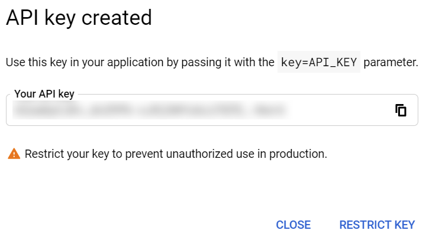

This will cover all the steps required to get set up with Google's Cloud Translate API service in order to use the Translate dialog feature in `dqxclarity`.

## Requirements

- A valid credit card
    - This service costs nothing for the first 500,000 characters per month, but if you go over this limit, it will start to cost. 500,000 characters is a lot and unless you're spending 10+ hours a day doing only story content, you are more than fine with this limit. Pricing for this service can be found [here](https://cloud.google.com/translate/pricing) if you're interested. `dqxclarity` uses the "Cloud Translation - Basic" services.

## Creating your Google project

- Navigate to https://console.cloud.google.com/
- If you aren't logged in to a Google account, you will be prompted to log in
- In the top menu, click "Select a project"

  

- Click "NEW PROJECT"

  

- Give the project a name recognizable to you: "DQX Translation" or something

  

- This will take you back to the main dashboard

## Set up your billing account

- Type "translate" at the top and select "Cloud Translation API"

  

- Click "Enable" to enable the Cloud Translation API for your project

  

- You will be prompted to link a billing account to your newly created project. This links a credit card (or other form of payment) to the project because you're using a billable service. For this use case, we need to set up a billing account, but will also be setting up some alerts on the account to let us know when we are about to spend money. Click "ENABLE BILLING".

  

- Click "MANAGE BILLING ACCOUNTS"

  

- Click "CREATE ACCOUNT"

  

- Name your billing account something meaningful to you (like: "my credit card" or something) and select your country, then click "CONTINUE"

  

- If you're using an existing Google account with existing payment methods linked to it, you will be prompted to use an existing payment method. If not, you will need to create one here

  

- Once you have filled this out, click "SUBMIT AND ENABLE BILLING"
- This will take you to the billing screen (if not, click the hamburger menu > Billing)

## Setting up billing alerts

- You are probably concerned with actually being billed by using this. You can set up billing alerts to let you know when things happen within your billing account (like when you're going to be charged)
- From the billing screen, click on "Budgets & alerts"

  

- Click "CREATE BUDGET"

  

- Give your budget alert a name ("DQX Translation Costs" or something)
- For services, I would leave everything selected as I want to know if I am being billed for anything
- Leave discounts and promotions checked
- Click "NEXT"

  

- For amount, put a penny (or whatever the absolute lowest amount is in your currency) and click "NEXT"

  

- For thresholds, I want to know when I am about to be charged as well as knowing _if_ I will be charged. Set your thresholds to something like this:

  

- Keep "Email alerts to billing admins and users" checked and click "FINISH"

  

## Enabling the Translation API

- Now, we need to go enable the Cloud Translate API service onto the project we made. Type "translate" at the top and click "Cloud Translation API"

  

- Click "ENABLE"

  

- Click "ENABLE BILLING"

  

- Select the billing account you set up

  

- Click "SET ACCOUNT"

## Create your API credential

- Finally, we now need to create an API credential to authenticate against this API. Click the hamburger menu in the top left > APIs and Services > Credentials

  

- Click "CREATE CREDENTIALS" at the top and click "API Key"

  

- Copy this API key and put it somewhere safe. This API key is essentially your password. Click "Restrict Key" in the bottom right. As this key has power to your account, we want to make sure if it does get exposed, little harm can be done

  

- Name the key something meaningful to you. In the bottom left, click "RESTRICT KEY" and type "translation" in the filter. Click "Cloud Translation API". Click "SAVE"

  

- You are all set. With the API key you previously copied, enter that into `dqxclarity` under the Google API section and you are good to go
